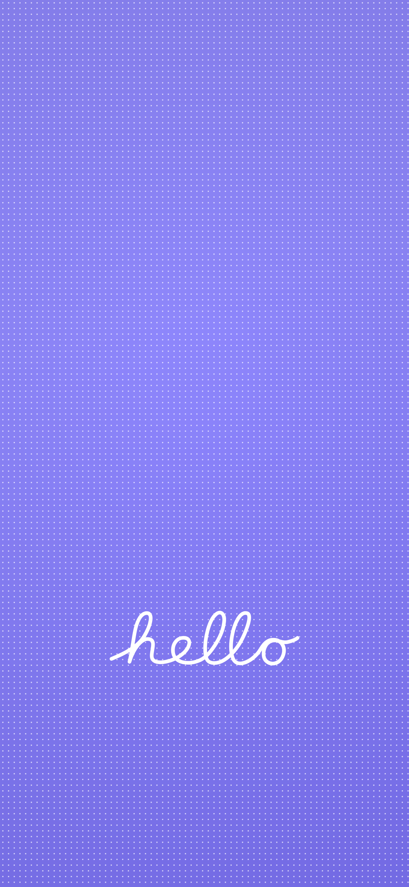

# Hello wallpaper

Независимый браузерный конфигуратор обоев в стиле приветствия iPhone: мягкий фон, сетка точек и векторная надпись **hello**.

**Сайт:** https://defffis.github.io/hello-wallpaper-configurator/

## Возможности

- Вектор `hello` из кривых Безье, подготовленный по референсу; одинаковая форма на всех устройствах, без загрузки шрифтов.
- Восемь пастельных палитр и случайные близкие оттенки HSL.
- Два цвета фона, мягкий градиент и виньетка.
- Цвет, прозрачность, радиус и шаг точек; прямоугольная сетка или смещение строк.
- Цвет, ширина, X/Y, толщина, угол и прозрачность надписи.
- Другие слова используют системный рукописный шрифт — интерфейс явно сообщает об отличии.
- Четыре пресета и свои размеры 320–6000 px по каждой стороне.
- Отдельный сглаженный предпросмотр без муара; исходный Canvas всегда сохраняет полное разрешение.
- PNG и JPEG, качество JPEG 10–100%; экспорт полного Canvas, а не экранного превью.
- Скачивание на desktop; Web Share и резервное окно изображения на мобильных устройствах.
- Сохранение настроек в localStorage, полный сброс, автоматическая светлая/тёмная тема.
- Без backend, регистрации, аналитики, внешних запросов и сборщика.

## Предпросмотр результата



## Запуск

Откройте `index.html` в браузере. Для локального HTTP-сервера:

```sh
python3 -m http.server 8000
```

Затем откройте http://localhost:8000. Для Web Share необходим HTTPS либо поддерживаемый безопасный localhost-контекст.

## Файлы

- `index.html` — интерфейс и адаптивные стили.
- `app.js` — состояние, векторный Canvas-рендеринг, сохранение и экспорт.
- `assets/hello.svg` — отдельный масштабируемый вектор надписи.
- `tests/responsive.html` — проверочная страница с четырьмя размерами viewport.
- `TESTING.md` — результаты и границы проверки.

## Совместимость и ограничения

Целевые браузеры: актуальные Chrome, Edge, Firefox, Safari, Chrome Android и Safari iOS. Подробности фактически выполненных проверок — в `TESTING.md`; тест на физическом iPhone требуется отдельно.

При подготовленном файле мобильный экспорт вызывает Web Share непосредственно по клику. Если файл ещё готовится или Web Share недоступен/отклонён, открывается окно с изображением и отдельными кнопками сохранения и отправки. Отмена системного меню не считается ошибкой.

6000 × 6000 требует около 144 MB только для RGBA-буфера; на устройствах с ограниченной памятью используйте меньший размер. Форма вектора `hello` одинакова; растеризация и сглаживание могут слегка различаться между браузерами. Вектор — авторская реконструкция по референсу, а не официальный ресурс Apple. Цвета фотографии зависят от камеры и дисплея, поэтому абсолютное совпадение оттенков не заявляется.

## GitHub Pages

Отдельный репозиторий `defffis/hello-wallpaper-configurator`. Публикация: **Settings → Pages → Deploy from a branch → main → / (root)**. Репозиторий `defffis.github.io` не используется.

This project is an independent wallpaper configurator and is not affiliated with or endorsed by Apple Inc.
