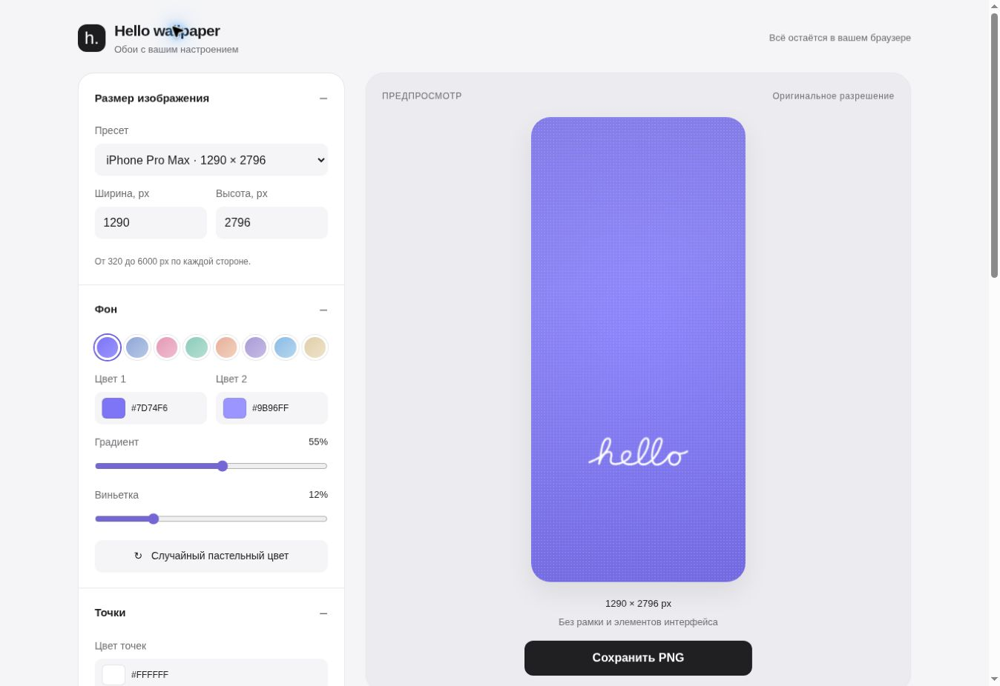

# Hello wallpaper

Независимый браузерный конфигуратор обоев в стиле приветствия iPhone: мягкий фон, сетка точек и векторная надпись **hello**.

**Сайт:** https://defffis.github.io/hello-wallpaper-configurator/

## Возможности

- Вектор `hello` из кривых Безье, подготовленный по референсу; одинаковая форма на всех устройствах, без загрузки шрифтов.
- Восемь пастельных палитр и случайные близкие оттенки HSL.
- Два цвета фона, мягкий градиент и виньетка.
- Цвет, прозрачность, радиус и шаг точек; прямоугольная сетка или смещение строк.
- Цвет, ширина, X/Y, толщина, угол и прозрачность надписи.
- Другие слова используют системный рукописный шрифт — интерфейс явно сообщает об отличии.
- Liquid Glass: многослойная оптическая модель с увеличением и преломлением фона внутри букв, мягким рассеиванием, направленной каустикой, деликатной цветовой дисперсией, зеркальным бликом и контактной тенью; регулируемая глубина. Базовый оттенок единообразен по всей надписи, а для тёмных цветов автоматически повышается оптическая плотность.
- Однократное написание hello или плавное появление любого текста, длительность 1–4 с, повтор по кнопке и временная шкала.
- Видео MP4 (при поддержке кодека браузером), иначе WebM; 480p/720p/1080p с сохранением пропорций, до 30 fps (зависит от производительности), без звука. Начальная пауза 0,2 с и финальное удержание 0,6 с. Длинная сторона ограничена 2560 px.
- Live Photo `.livp` для живых обоев iOS: короткий профиль Bounce (58 кадров, около 1,93 с), совпадающие начальный/конечный кадры и JPG, `com.apple.photos.variation-identifier = 2`, `LOOP = 0`, общий Content Identifier и timed metadata track `com.apple.quicktime.still-image-time`.
- Четыре телефонных пресета, два компьютерных пресета и свои размеры 320–6000 px по каждой стороне.
- Увеличенный адаптивный предпросмотр, отдельное полноэкранное окно и сглаживание без муара; исходный Canvas всегда сохраняет полное разрешение.
- PNG и JPEG, качество JPEG 10–100%; экспорт полного Canvas, а не экранного превью.
- Скачивание на desktop; Web Share и резервное окно изображения на мобильных устройствах.
- Сохранение настроек в localStorage, полный сброс, автоматическая светлая/тёмная тема.
- Без backend, регистрации, аналитики, внешних запросов и сборщика.

## Установка живых обоев

Обычный MP4/WebM содержит одно появление и заканчивается готовой надписью. Экспорт Live Photo использует отдельный Bounce-профиль: надпись появляется и возвращается к исходному кадру, чтобы неподвижный JPG совпадал с обоими краями видео.

**iPhone:** используйте **«Скачать Live Photo (.livp)»**, сохраните файл в «Файлы» и импортируйте через PhotoSync. Внутри находится пара `LIVE_….JPG` + `LIVE_….MOV`; Safari самостоятельно не создаёт из неё единый `PHAsset`. После появления Live Photo в «Фото» добавьте его на экран блокировки и включите кнопку воспроизведения. [Инструкция Apple](https://support.apple.com/en-us/120734).

**Компьютер / Android:** импортировать видео в приложение живых обоев, которое поддерживает нужный системный триггер, однократный запуск и удержание последнего кадра.

Во время записи вкладка должна оставаться видимой. Отмена, уход со вкладки или ошибка освобождают поток и возвращают настройки. Браузеры без MediaRecorder показывают понятное сообщение и сохраняют экспорт PNG/JPEG.

## Интерфейс



[Проверка мобильной компоновки](assets/editor-mobile-check.jpg)

## Предпросмотр результата


## Запуск

Откройте `index.html` в браузере. Для локального HTTP-сервера:

```sh
python3 -m http.server 8000
```

Затем откройте http://localhost:8000. Для Web Share необходим HTTPS либо поддерживаемый безопасный localhost-контекст.

## Файлы

- `index.html` — интерфейс и адаптивные стили.
- `app.js` — состояние, векторный Canvas-рендеринг, сохранение и экспорт.
- `assets/hello.svg` — отдельный масштабируемый вектор надписи.
- `tests/responsive.html` — проверочная страница с четырьмя размерами viewport.
- `TESTING.md` — результаты и границы проверки.

## Совместимость и ограничения

Целевые браузеры: актуальные Chrome, Edge, Firefox, Safari, Chrome Android и Safari iOS. Подробности фактически выполненных проверок — в `TESTING.md`; поведение прямого Web Share уже проверено на физическом iPhone и признано неподходящим для создания единого Live Photo. Canvas-эффект следует описанной Apple оптической структуре Liquid Glass — отражение, преломление, тень, размытие и блики — но не использует закрытый системный шейдер iOS/macOS.

При подготовленном файле мобильный экспорт вызывает Web Share непосредственно по клику. Если файл ещё готовится или Web Share недоступен/отклонён, открывается окно с изображением и отдельными кнопками сохранения и отправки. Отмена системного меню не считается ошибкой.

6000 × 6000 требует около 144 MB на каждый RGBA-буфер, а рендерер использует несколько буферов; на устройствах с ограниченной памятью используйте меньший размер. Форма вектора `hello` одинакова; растеризация и сглаживание могут слегка различаться между браузерами. Вектор — авторская реконструкция по референсу, а не официальный ресурс Apple. Цвета фотографии зависят от камеры и дисплея, поэтому абсолютное совпадение оттенков не заявляется.

## GitHub Pages

Отдельный репозиторий `defffis/hello-wallpaper-configurator`. Публикация: **Settings → Pages → Deploy from a branch → main → / (root)**. Репозиторий `defffis.github.io` не используется.

This project is an independent wallpaper configurator and is not affiliated with or endorsed by Apple Inc.
